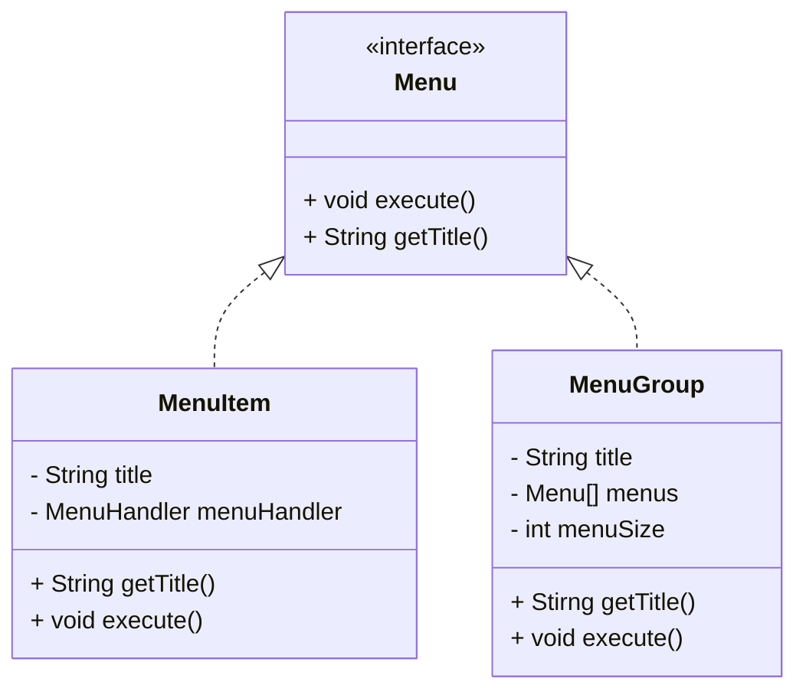
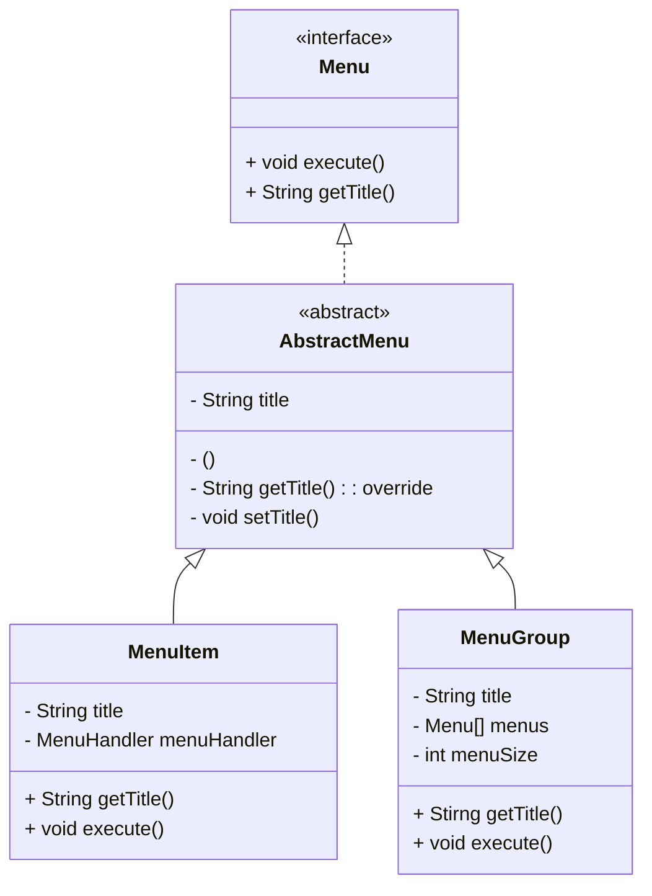
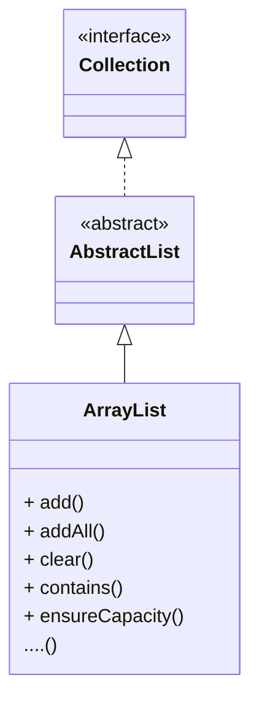
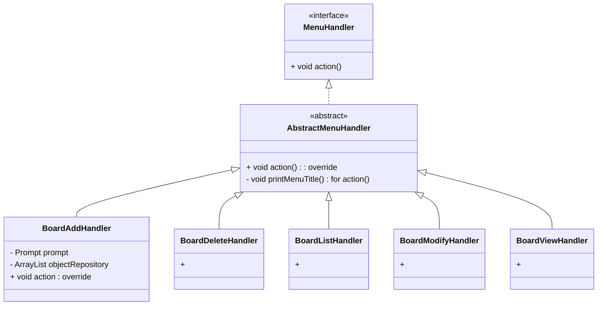
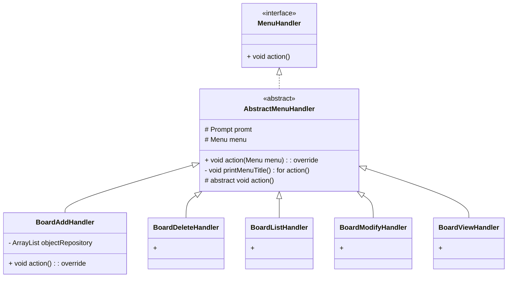

# 23 : 상속과 추상 클래스/추상 메서드, 접근제어

날짜: 2023년 12월 19일

23. 상속(generalization)과 추상 클래스/추상 메서드, 접근 제어 활용하기

- MenuItem과 MenuGroup의 공통 코드를 추출하여 수퍼 클래스를 정의하기
- MenuHandler 구현체의 공통 분모를 추출하여 수퍼 클래스 정의하기
- 수퍼 클래스를 추상 클래스로 정의하여 직접 사용을 막기
- 추상 메서드를 선언하여 서브 클래스에게 구현을 강요하기
- 서브 클래스가 의존 객체를 사용할 수 있도록 접근 범위를 protected로 설정하기

## 실습



### interface에 따라 정의된 두개의 클래스가 공통으로 사용하는 필드나 메서드를 일반화하는 새로운 클레스를 만들자



- 두개의 클래스를 일반화하면서, 서브클래스에서 알아서 구현할 내용도 있으므로 abstract class로 만든다.
- 주의. 이때 공통필드인 title을 수퍼클래스로 옮기면서 추상화객체에서 생성자를 구현해줘야한다. 왜냐하면 abstract class는 인스턴스를 생성할 수 없어서 생성자가 필요없을 것 같지만, 서브클래스의 생성자에서 title을 다뤄야하기 떄문이다



- 이런 방식은 ArrayList에서도 볼 수 있다.



- MenuHandler도 추상화 클래스를 만들어 보자.
    
    공통되는 부분들을 뽑아서 추상화 클래스에 정의하였다.
    

```java

class BoardAddHandler extends AbstractMenuHandler{
@Override
	action(){
		super.action();
	}
}
---

class AbstractMenuHandler implements MenuHandler{
	@Override
	public void action(Menu menu){ //
		~~
		this.action();
	}

	public abstract void action(); // 서브클래스가 구현한다.
```

### super클래스의 action()동작도 수행하고 서브클래스의 action()동작도 이어서 수행하게 코딩하기

- 원래는 모든 handler들이 공통으로 갖고있는 action기능만 가져왔는데 (printMenuTitle(String title)로 구현해 놓았다) 오버라이딩하면 자식객체에 각각 다르게 갖고있는 action만 덮어씌워서 실행하게된다.
    
    위 코드는 그것을 해결한 것이다.
    
1. BoardAddHandler.action(Menu menu)가 호출되면 BoardAddHandler에 없으므로 부모클래스인 AbstractMenuHandler에 정의된 대로 사용한다.
2. 그때 action()을 실행해야하는데 BoardAddHandler에 정의되어있으므로 실행한다.
    
    =⇒ 수퍼클래스의 메서드동작에 이어서 서브클래스의 메서드동작이 **이어지게 하고 싶을때** 이렇게 작성할 수 있다. 
    
    이 방식으로 클래스를 작성하면 하위 클래스나 수퍼클래스를 수정하고싶을때 각각의 클래스의 연결성이 분리되어있으므로 유지보수가 쉽다.
    

```java
public class BoardViewHandler extends AbstractMenuHandler {

  private ArrayList<Board> objectRepository;
	private Prompt prompt;

  public BoardViewHandler(ArrayList<Board> objectRepository, Prompt prompt) {
    this.prompt = prompt;
    this.objectRepository = objectRepository;
  }
	...
}
----------------------------- 변경 -----------------------------

public class BoardViewHandler extends AbstractMenuHandler {

  private ArrayList<Board> objectRepository;
 
  public BoardViewHandler(ArrayList<Board> objectRepository, Prompt prompt) {
    super(prompt);
    this.objectRepository = objectRepository;

  }
	...
}
```

```java
public abstract class AbstractMenuHandler implements MenuHandler{

  protected Prompt prompt;
	protected Menu menu;

  public AbstractMenuHandler(Prompt prompt) {
    this.prompt = prompt;
  }
...
	protected abstract void action();
}
```

- 막상 클래스들의 공통된 메서드나 필드를 추상화클래스로 묶는 김에 의존객체인 prompt도 옮겨보자



- 최종단계의 class관계도
    
    공통 의존객체까지 수퍼클래스에 정의하였다.
    
    그리고 자식객체들이 사용해야하는 의존객체나 추상화 메서드는 protected 접근 제한을 주었다.